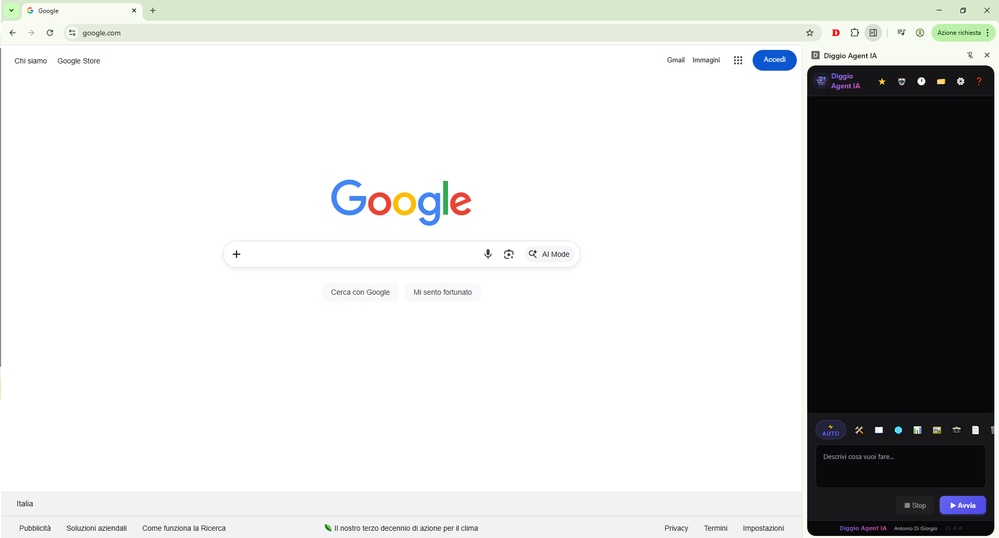
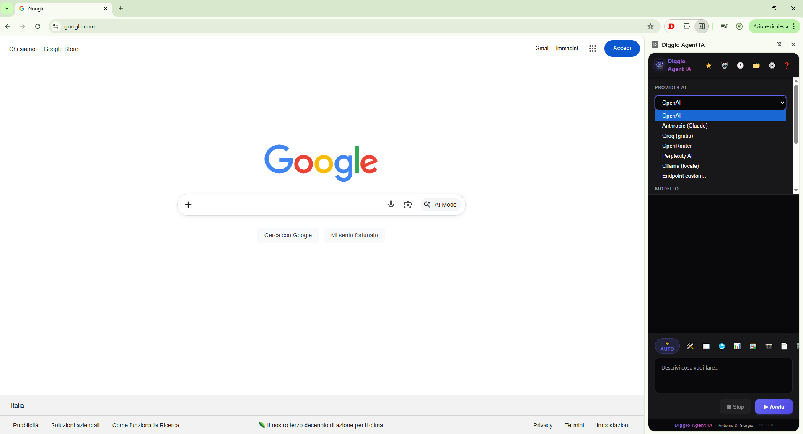

# 🤖 Diggio Agent IA

### Il tuo agente AI che usa Chrome al posto tuo — con qualsiasi modello, la tua chiave.

Scrivi cosa vuoi fare **in italiano, in una frase**. L'agente apre i siti, clicca, compila i form, confronta prezzi, analizza pagine e ti riporta il risultato — mentre tu fai altro.

> *"Cerca su Amazon e eBay una cuffia wireless sotto i 50€ con 4+ stelle e Prime, e dimmi le 3 migliori."*
> → L'agente lo fa davvero. Tu guardi lavorare.

[](https://chrome.google.com/webstore)
[](LICENSE)
[](manifest.json)
[](#-porta-la-tua-ai-nessun-lock-in)

---

## 📸 Screenshot

<div align="center">
  
  <br/><br/>
  
</div>

---

## 🎯 Perché Diggio Agent IA?

Non è l'ennesimo chatbot in una barra laterale. È un **agente autonomo** che *agisce* nel browser — e lo fa in modo affidabile grazie a scelte che di solito trovi solo negli agenti commerciali:

- **🧠 Ricorda e impara.** Continua i task precedenti della stessa conversazione senza che tu ripeta nulla, e memorizza come funziona ogni sito (selettori, trucchi, pattern URL) riusandolo alle visite successive.
- **🎯 Clicca dove serve, davvero.** Con la tecnica *Set-of-Marks* numera visivamente gli elementi della pagina e clicca per numero — affidabile anche sulle web-app complesse (Google Ads, gestionali, SPA), dove i selettori classici falliscono.
- **👁️ Verifica quello che fa.** Dopo ogni azione riceve uno screenshot e controlla che l'effetto sia quello atteso, invece di procedere alla cieca.
- **🙋 Ti chiede quando serve.** A metà task può farti una domanda e aspettare la tua risposta — niente scelte azzardate al posto tuo.
- **🔑 Nessun lock-in.** Porti la *tua* chiave e scegli il *tuo* provider: da GPT e Claude fino ai modelli **gratis in locale** con Ollama o LM Studio. Zero abbonamenti, zero server intermedi.

---

## ✨ Cosa sa fare

**🕹️ Controllo browser (30 azioni)** — naviga, clicca (per selettore, testo, numero o coordinate), digita, compila form e select, scrolla, preme tasti, apre e raggruppa schede, esegue JavaScript nella pagina.

**🔬 Analisi tecnica (come DevTools)** — legge la **console** (errori JS, warning), le **richieste di rete** (XHR/fetch, script esterni, risorse fallite 404/500) e fa **zoom** su una regione per leggere testo piccolo.

**🛠️ Strumenti pronti all'uso:**
- 📈 **Analisi SEO** completa con punteggio 0-100 + diagnostica tecnica
- 📣 **Analisi Google Ads** — campagne, keyword, termini di ricerca, annunci (ogni modifica richiede la tua conferma: protezione budget)
- 🛡️ **Controllo sicurezza sito** — VirusTotal, SSL, header, scansione del codice sorgente
- 🕵️ **Verifica truffa** — 15 indicatori di frode + WHOIS + Trustpilot + Wayback
- 💰 **Scraper prezzi** con modalità monitoraggio continuo
- ⚖️ **Confronto prodotti** tra più URL con tabella comparativa
- 📝 **Form Filler** — compila qualsiasi form con i tuoi dati salvati

**⚙️ Produttività:**
- 🤖 **Automazioni programmate** (Chrome Alarms) — girano in background anche a pannello chiuso
- 🖼️ **Vision** — allega un'immagine come riferimento per confronti visivi
- ⭐ **Template** riutilizzabili · 🕐 **Cronologia** ricercabile · 📊 **Export** CSV/JSON/HTML
- 🔧 **Tool calling nativo** (opzionale) — azioni come chiamate funzione strutturate, con fallback automatico se il modello non le supporta

---

## 🔑 Porta la tua AI (nessun lock-in)

| Provider | Endpoint | Note |
|----------|----------|------|
| **OpenAI** | `api.openai.com` | GPT-4o, GPT-4o-mini, GPT-4-turbo |
| **Anthropic** | `api.anthropic.com` | Claude Opus, Sonnet, Haiku |
| **Groq** | `api.groq.com` | Llama 3.3, Mixtral, Gemma — **gratis** con limiti generosi |
| **OpenRouter** | `openrouter.ai` | Centinaia di modelli con una sola chiave |
| **Perplexity AI** | `api.perplexity.ai` | Sonar Pro, Sonar Reasoning |
| **Ollama** 🖥️ | `localhost:11434` | Qualsiasi modello sul tuo PC — **100% privato e gratis** |
| **Ollama.com** ☁️ | `ollama.com/v1` | Modelli cloud di Ollama con API Key |
| **LM Studio** 🖥️ | `localhost:1234` | Modelli locali via LM Studio |
| **Custom** | Qualsiasi URL | Open WebUI, llama.cpp, o qualsiasi endpoint OpenAI-compatibile |

I modelli si **caricano automaticamente** dall'endpoint con un clic su 🔄 — nessuna configurazione manuale.

> 💡 **Uso locale?** Avvia Ollama con `OLLAMA_ORIGINS=chrome-extension://*` (o LM Studio con il server attivo e CORS): l'estensione ti guida se qualcosa non risponde.

---

## 🚀 Installazione

### Da Chrome Web Store *(consigliato)*
1. Vai sul [Chrome Web Store](#) *(link in arrivo)*
2. Clicca **Aggiungi a Chrome**
3. Apri il pannello laterale cliccando l'icona 🤖 in toolbar

### Manuale (sviluppatori)
```bash
git clone https://github.com/Diggio3000/diggio-agent-ia.git
```
1. Apri Chrome → `chrome://extensions/`
2. Attiva **Modalità sviluppatore** (in alto a destra)
3. Clicca **Carica estensione non compressa**
4. Seleziona la cartella `diggio-agent-ia`

---

## ⚙️ Configurazione in 30 secondi

1. Clicca **⚙️** nell'header del pannello
2. Scegli il **Provider AI** → l'**endpoint** si compila da solo
3. Incolla la tua **API Key**
4. Premi **🔄** per caricare i modelli, scegline uno
5. **💾 Salva e testa** — pronto!

---

## 💬 Prova con questi

```
Vai su amazon.it e cerca "cuffie wireless" ordinando per prezzo crescente.
Trovami le 3 migliori entro 50€ con almeno 4 stelle e spedizione Prime.
```
```
Analizza tecnicamente questo sito: che tecnologie usa, errori in console,
script esterni caricati e problemi SEO più urgenti.
```
```
Controlla se https://sito-sconosciuto.com è una truffa o un sito legittimo.
```
```
Apri il mio account Google Ads e dimmi quali campagne sprecano budget.
```
```
Monitora il prezzo di questo prodotto ogni ora e avvisami quando scende sotto 80€.
```

---

## 🔒 Privacy prima di tutto

- Le API Key restano **solo sul tuo dispositivo** (`chrome.storage.sync`)
- I dati vanno **direttamente al provider AI che scegli tu** — nessun server intermedio Diggio
- **Zero telemetria, zero tracciamento, zero raccolta dati**
- Con Ollama o LM Studio in locale, **nulla lascia il tuo computer**

👉 [Privacy Policy completa](https://Diggio3000.github.io/diggio-agent-ia-privacy/)

---

## 🏗️ Struttura del progetto

```
diggio-agent-ia/
├── manifest.json              # Manifest V3
├── background/
│   ├── worker.js              # Service worker: loop agente ReAct, memoria, azioni
│   ├── diggio-client.js       # Client multi-provider, system prompt, tool calling
│   ├── cdp-controller.js      # Chrome DevTools Protocol: azioni browser, console/rete
│   └── tab-manager.js         # Gestione schede Chrome
├── sidepanel/
│   ├── panel.html             # UI pannello laterale
│   ├── panel.js               # Logica: chat, impostazioni, strumenti guidati
│   └── panel.css              # Stile dark theme
└── icons/
```

---

## 🤝 Contribuire

1. Fai un **fork** del repository
2. Crea un branch: `git checkout -b feature/nuova-funzione`
3. Commit e push, poi apri una **Pull Request**

Per bug e idee: apri una [Issue](https://github.com/Diggio3000/diggio-agent-ia/issues).

---

## 📄 Licenza

[GPL v3](LICENSE) — Copyright © 2026 Antonio Di Giorgio (Diggio3000)

---

## 👤 Autore

**Antonio Di Giorgio** — per tutti **Diggio3000**

🌐 [www.diggio3000.it](https://www.diggio3000.it) &nbsp;·&nbsp; 📧 [diggiotelefonia@gmail.com](mailto:diggiotelefonia@gmail.com)

Sviluppo **PrestaShop**, automazioni e soluzioni digitali su misura per eCommerce e aziende.

---

<div align="center">

**⭐ Se Diggio Agent IA ti è utile, lascia una stella al repo!**

*Il tuo agente AI che usa Chrome al posto tuo.*

</div>
