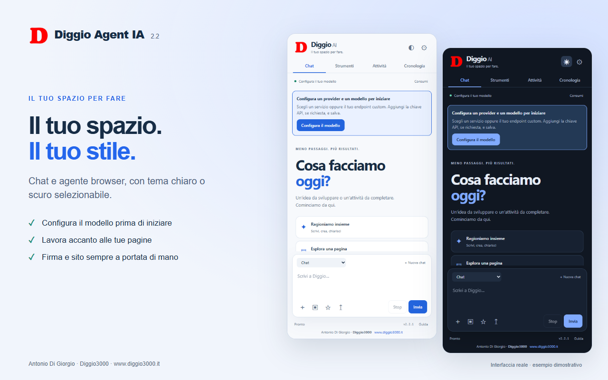

# Diggio Agent IA 2.2

Chat e automazione del browser con il modello che scegli tu.



[Guida con esempi](docs/ESEMPI.md) · [Privacy](docs/PRIVACY.md) · [Novità](CHANGELOG.md) · [Materiali Store](docs/STORE.md)

## Modalità

- **Insegnami**: costruisci procedure in chat o registrando i tuoi clic; correggile, approvale e riusale.
- **Chat**: conversazione, scrittura e analisi degli allegati, senza accesso al browser.
- **Agente autonomo**: lavora sulla scheda scelta. JavaScript e azioni sui domini sensibili richiedono approvazione.
- **Con approvazione**: esamina, modifica o salta ogni comando prima dell’esecuzione.

Tema chiaro/scuro selezionabile, piano di lavoro visibile, conversazioni riprendibili, preferenze personali, strumenti guidati e automazioni programmate.

La Chat mostra subito che non controlla il browser. **Usa il browser** seleziona **Con approvazione**, conserva la bozza e attende il tuo invio. L’agente può aprire risultati e passare esplicitamente fra le schede della propria attività; ogni lettura riporta l’URL della fonte.

Riprendendo la conversazione nella stessa sessione di Chrome, l’agente può ritrovare le proprie schede ancora aperte. Dopo un riavvio del browser occorre selezionare nuovamente la pagina: gli ID salvati non vengono usati per controllare altre schede. Il limite di output del provider è distinto dal budget locale; una risposta interrotta viene segnalata come parziale.

## Installazione locale

1. Apri `chrome://extensions` in Chrome 120 o successivo.
2. Attiva Modalità sviluppatore.
3. Scegli **Carica estensione non pacchettizzata** e seleziona questa cartella.
4. Apri il pannello dall’icona dell’estensione e configura il modello.

Il pacchetto nella cartella `dist` contiene solo l’estensione. Estrailo prima di caricarlo manualmente.

## Connessioni e servizi custom

Scegli un provider oppure **Endpoint custom**. Inserisci:

- Indirizzo base, come `https://api.example.com/v1`, oppure endpoint completo.
- Chiave API, solo se richiesta dal servizio.
- Nome esatto del modello, scritto manualmente o selezionato con **Carica**.

Nella compatibilità avanzata puoi scegliere OpenAI compatibile o Anthropic Messages, un URL separato per l’elenco modelli, autenticazione Bearer o tramite header personalizzato, oppure nessuna autenticazione. Per un gateway PHP, l’elenco viene richiesto con GET allo stesso endpoint; è possibile cambiarlo. Sono riconosciute liste OpenAI, Ollama e risposte con modelli dentro `data.models`.

Per i modelli con nomi personalizzati imposta esplicitamente il supporto immagini. Il servizio deve implementare uno dei protocolli supportati: il modulo non converte API arbitrarie o pagine HTML in API AI. Gli endpoint locali possono richiedere una configurazione CORS sul server.

I profili dei provider vengono conservati separatamente. **Salva** non invia richieste; **Salva e verifica** invia un breve messaggio al servizio scelto. Un elenco modelli su un’origine differente non riceve implicitamente la chiave dell’endpoint chat.

## Computer use e suite Google

L’agente osserva screenshot, elementi visibili e albero di accessibilità. Può usare clic e doppio clic, scorrimento, attese, scorciatoie combinate e inserimento nell’editor attivo. I bersagli ambigui, coperti o cambiati vengono rifiutati; prima di scrivere viene verificato il focus. Sono supportati elementi nello Shadow DOM aperto e, per l’editor a fuoco, frame della stessa origine.

Dagli Strumenti puoi preparare richieste per Documenti, Fogli e Presentazioni Google. L’agente lavora sulla pagina nella sessione Google già aperta, usando menu e tastiera: non richiede OAuth né API Google. Accesso, CAPTCHA e campi riservati restano all’utente. Gli editor canvas e i frame non accessibili possono limitare lettura, selezione e modifica. I controlli generali sono verificati con pagine locali; non è dichiarata una compatibilità completa con gli editor Google reali. Per lavorare per immagini serve un modello con visione.

## Insegnami

In **Strumenti → Insegnami**, descrivi la procedura in chat oppure scegli una scheda e registra la dimostrazione. Termina, controlla la bozza, sostituisci i dati variabili con `{{segnaposto}}` e scegli **Approva e salva**. Ogni modifica salvata crea una nuova revisione; sono disponibili fino a 50 procedure. **Prepara in chat** inserisce la procedura nella bozza del messaggio: l’esecuzione parte solo quando premi **Invia**.

La registrazione raccoglie clic e indicazioni dei campi, senza registrarne i valori. Non registra eventi nei frame; si ferma cambiando origine, chiudendo la scheda oppure dopo 20 minuti o 100 passaggi. Le azioni dimostrate hanno effetto reale sul sito. Etichette, selettori e percorsi possono comunque contenere dati personali: controllali prima di salvare. Si tratta di istruzioni riutilizzabili, non di addestramento dei pesi del modello.

## Consumi, limiti e abbonamenti

**Consumi** distingue connessione e modello, su 1, 7 o 30 giorni. Mostra token comunicati dal servizio, copertura parziale, errori e limiti HTTP quando disponibili. Non inventa saldi: “Non disponibile” è diverso da zero. Il budget dell’agente è un limite locale, separato dal limite del provider. Le rilevazioni dei limiti hanno una data e non sono un saldo in tempo reale.

Il budget token locale è **facoltativo e disattivato per impostazione predefinita**. In **Impostazioni → Memoria e limiti**, lascia il campo vuoto oppure scrivi **0** e salva per non applicare una soglia token. Per attivarla, inserisci un intero di almeno 1000. Il vecchio valore predefinito di 80.000 viene rimosso una sola volta durante l’aggiornamento, anche nei profili e nelle automazioni; le soglie precedenti diverse da 80.000 vengono conservate. Dopo l’aggiornamento puoi scegliere anche 80.000 esplicitamente.

Quando attivo, il budget cumula input e output di tutte le richieste, incluso il contesto reinviato. Non è la dimensione massima della conversazione né la quota Ollama. Il controllo avviene dopo la risposta e può superare la soglia nell’ultima richiesta. I consumi restano registrati anche senza budget. I limiti imposti dal provider restano applicabili.

Anche il **limite dei passaggi è facoltativo e disattivato per default**: lascia vuoto o imposta 0, oppure scegli un intero positivo. Il precedente valore predefinito di 40 viene rimosso una sola volta; le soglie personalizzate diverse vengono conservate. Puoi impostare nuovamente 40 dopo l’aggiornamento. Stop, timeout e gestione degli errori restano attivi. Le letture identiche ripetute provocano un invito a cambiare strategia e, se persistono, una richiesta di indicazioni all’utente. L’assenza di una soglia non garantisce il completamento: il modello può incontrare ostacoli o limiti del servizio.

OpenRouter permette di aggiornare esplicitamente il limite della chiave: non è il saldo complessivo dell’account. Per Ollama, anche quando il modello è cloud, vengono conteggiati i token restituiti e fornito il collegamento alla dashboard; piano, residuo e rinnovo si controllano presso Ollama.

Il plugin usa API, non le sessioni web ChatGPT o Claude. Gli abbonamenti ChatGPT e Claude non includono automaticamente il credito API. Ollama locale non richiede un abbonamento API; l’accesso ai modelli cloud dipende dall’account e dal piano Ollama, con autenticazione sul servizio locale oppure una chiave quando richiesta dall’endpoint cloud. Il plugin non include crediti e non aggira i limiti dei servizi.

Fonti ufficiali: [Claude e API](https://support.claude.com/en/articles/9876003-i-have-a-paid-claude-subscription-pro-max-team-or-enterprise-plans-why-do-i-have-to-pay-separately-to-use-the-claude-api-and-console), [OpenAI API](https://openai.com/api/pricing/), [Ollama cloud](https://docs.ollama.com/cloud).

## Conversazioni e dati

Le chiavi e le impostazioni sono nello storage locale di Chrome; le impostazioni precedentemente in Sync vengono migrate e rimosse da Sync. Nessun server dello sviluppatore è necessario. Testo, immagini e osservazioni necessari al compito vengono trasmessi al provider configurato.

Le conversazioni vengono aggiornate senza duplicati e si possono riprendere dalla Cronologia. Sono conservate fino a 30 conversazioni entro un budget di circa 6,5 MB stimati. Le preferenze personali si modificano nelle Impostazioni; le note tecniche dei siti negli Strumenti. Non salvare password nelle preferenze.

I valori dei campi password vengono esclusi dalla numerazione e mascherati negli screenshot. L’agente non compila campi password e alcuni campi riservati. Questo non costituisce una garanzia di rimozione di ogni dato sensibile presente su una pagina.

## Automazioni

Un’attività programmata conserva la connessione scelta alla creazione, utilizza una scheda dedicata e salva il risultato in Cronologia. Puoi impostare intervallo o giorni/orario, massimo esecuzioni e una condizione di arresto in linguaggio naturale. Il modello deve fornire un’evidenza per dichiararla raggiunta.

Un’attività che richiede conferma o risposta attende l’utente e mostra una notifica. Stop interrompe la richiesta corrente e impedisce nuovi comandi; non annulla azioni già eseguite. Il computer e Chrome devono essere disponibili per eseguire gli eventi programmati.

## Sviluppo e verifica

Richiede Node.js recente e Python 3 per creare lo ZIP.

```sh
npm ci
npm test
npx playwright install chromium
npm run test:ui
npm run package
```

Le prove browser usano un profilo isolato e un servizio AI simulato sulla macchina locale. Non richiedono chiavi e non contattano servizi AI commerciali. Screenshot e report di test finiscono in `test-results`, esclusa da Git e dal pacchetto.

Il codice comune alle edizioni si aggiorna tramite lo script di sincronizzazione nella cartella del progetto principale. Non modificare separatamente copie dei moduli condivisi.

## Struttura

- `background`: ciclo agente, controllo CDP e client AI.
- `shared`: provider, sicurezza, scheduler e rendering.
- `sidepanel`: interfaccia senza framework e senza dipendenze runtime.
- `tests`: regressioni e prove browser.
- `scripts`: packaging riproducibile.

Licenza GPL v3. Autore: Antonio Di Giorgio — [www.diggio3000.it](https://www.diggio3000.it).
