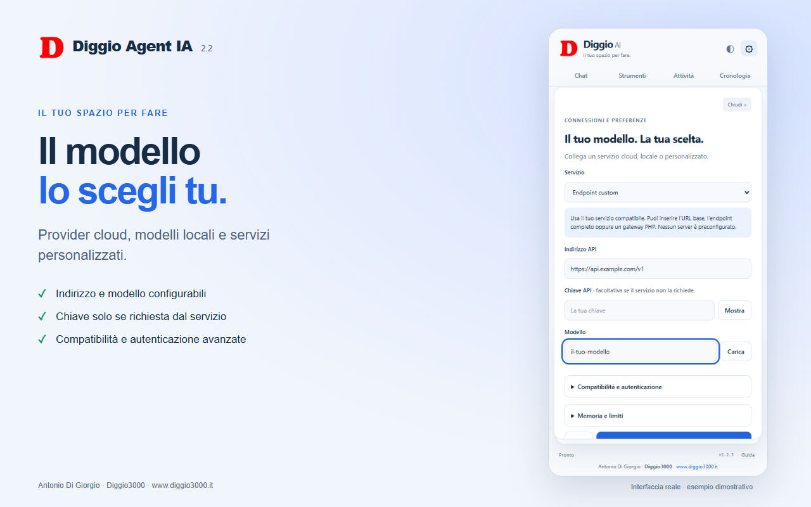
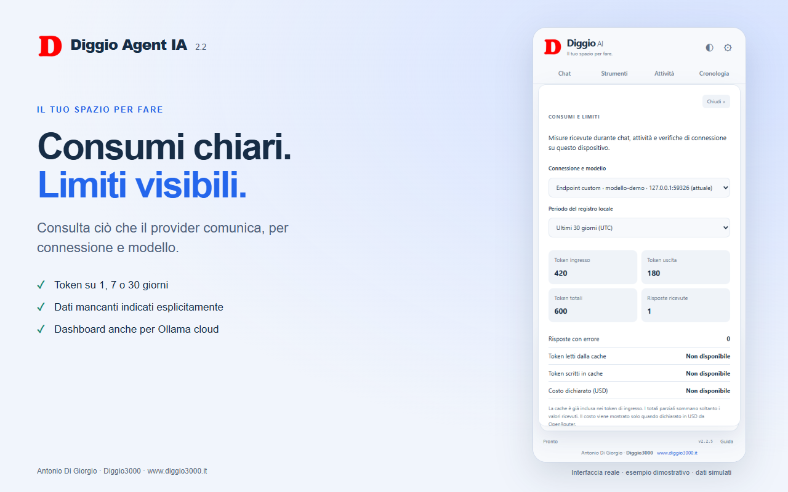
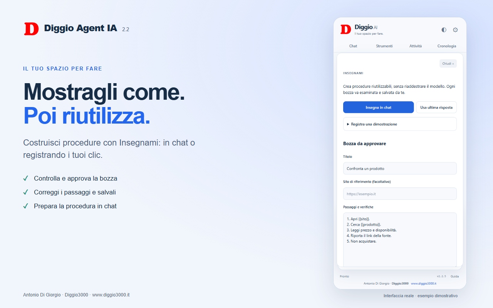

# Immagini della versione 2.2.5

Cinque screenshot 1280×800 e due grafiche promozionali (440×280 e 1400×560). L’interfaccia è catturata dall’estensione reale caricata in Chromium isolato. Risposte AI e consumi sono simulati; non sono screenshot di esecuzioni reali su Google Workspace.

Rigenerazione: `node scripts/store-assets.mjs` dopo aver installato Playwright e Chromium. Nessuna chiave richiesta.

